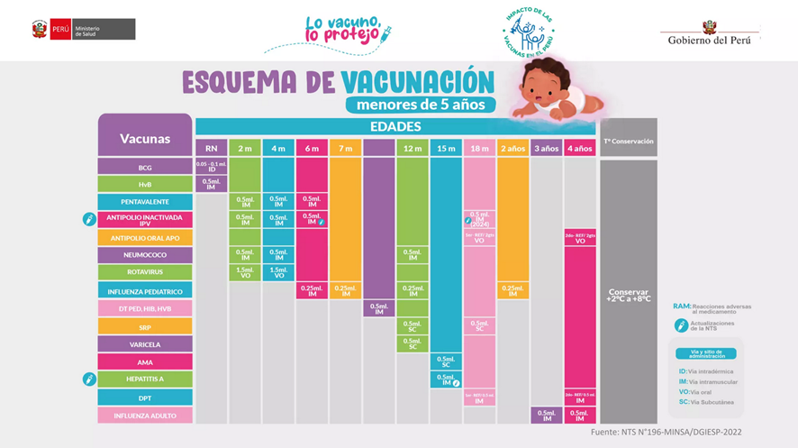

# Unidad 4: Enfermedades inmunoprevenibles 
## Actualización del esquema de vacunación 
_Da click en la imagen para acceder al recurso_

### Infografía 

Fuente: MINSA

## Enfermedades eruptivas infantiles 
_Da click en la imagen para acceder al recurso_

## Sarampión: Diagnóstico diferencial y vigilancia epidemiológica 
_Da click en la imagen para acceder al recurso_

## Tos convulsiva (coqueluche): Generalidades
_Da click en la imagen para acceder al recurso_

## Meningitis: Generalidades 
_Da click en la imagen para acceder al recurso_

